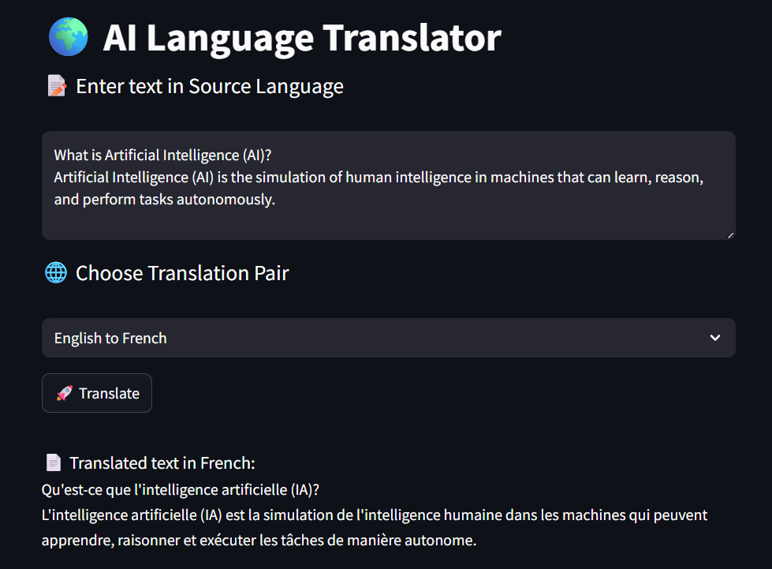

# AI Language Translator

🌍 **AI Language Translator** is a Streamlit web app that uses Hugging Face MarianMT models to provide real-time translations between English and multiple languages.



## Features:
- Translate text from **English** to various languages such as French, Spanish, German, Italian, Chinese, Arabic, Hindi, and Swahili.
- Simple and intuitive user interface powered by Streamlit.
- Supports multiple language pairs, making it versatile for different use cases.

## Supported Language Pairs:
- English to French
- English to Spanish
- English to German
- English to Italian
- English to Chinese
- English to Arabic
- English to Hindi
- English to Swahili

## Installation:

To run the app locally:

1. Clone the repository:

   ```bash
   git clone https://github.com/prasanth624/AI-Language-Translator.git
   ```

2. Navigate to the project directory:

   ```bash
   cd AI-Language-Translator
   ```

3. Install the dependencies:

   ```bash
   pip install -r requirements.txt
   ```

4. Run the Streamlit app:

   ```bash
   streamlit run app.py
   ```

5. Open your browser and go to `http://localhost:8501` to use the app.

## Contributing
Feel free to fork the repository and submit pull requests for any improvements or features you'd like to add!

## License:
This project is licensed under the MIT License - see the [LICENSE](LICENSE) file for details.
